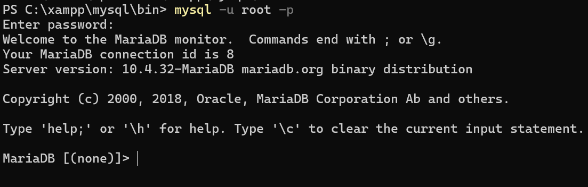

# Belajar Structured Query Language (SQL)

Pada kali ini, kita akan belajar menggunakan query SQL berbasis Command Line Interface (CLI) menggunakan aplikasi Laragon dan XAMPP. Agar query tidak error, jangan lupa untuk mengaktifkan database MySQL di control panel aplikasi Laragon atau XAMPP.

### Via Laragon
Buka terminal atau CMD dan ketikan perintah:
```bash
cd C:\laragon\bin\mysql\mysql-8.0.30-winx64
```
```mysql-8.0.30-winx64``` adalah direktori versi MySQL saya, sesuaikanlah dengan milik kalian.

Klik enter, kemudian masukkan perintah
```bash
mysql -u root -p
```
Klik enter, setelah itu akan di mintai password, masukkan password jika DB MySQL kalian di password, jika tidak langsung klik enter. Jika tidak ada error maka hasilnya akan seperti dibawah ini.


### Via XAMPP
Buka terminal atau CMD dan ketikan perintah:
```bash
cd C:\xampp\mysql\bin
```
Klik enter, kemudian masukkan perintah
```bash
mysql -u root -p
```
Klik enter, setelah itu akan di mintai password, masukkan password jika DB MySQL kalian di password, jika tidak langsung klik enter. Jika tidak ada error maka hasilnya akan seperti dibawah ini.


